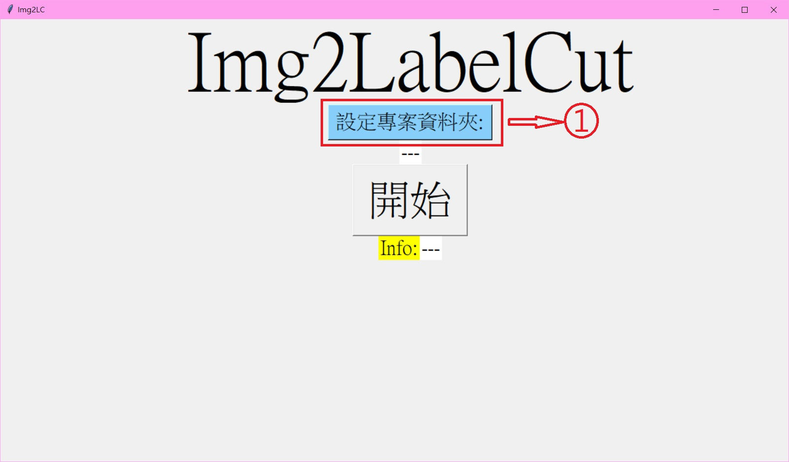
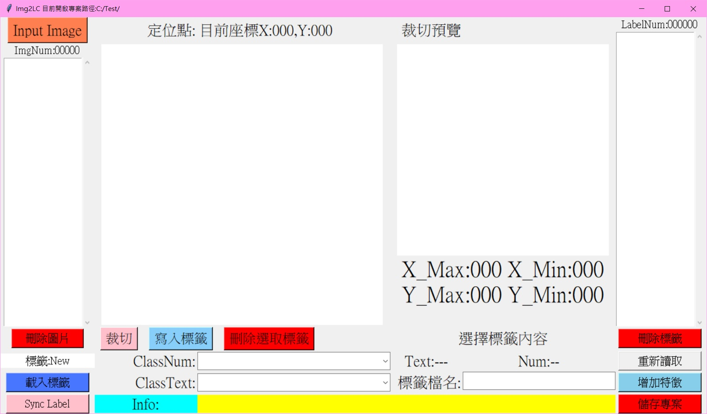
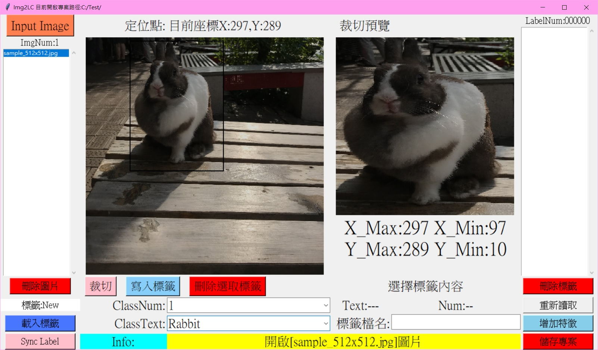

# Image to Label Cut

## About:
* 建議使用 Python3.6+
* 使用 Python3 內建 Tkinter 介面撰寫
* 使用於Machine Learn Object Detection 標籤資料集製作
* 建議使用Windowes執行，Linux目前會有UI跑版的Bug但功能均正常，後續版本會修正此問題
## Install from PyPI:
* Pillow

        pip install Pillow

## User guide:

* Sept 1:

    * 使用終端機運行

       \_\_main\_\_.py

* Sept 2:
    
    

    * 執行時會先要求輸入專案資料夾,做為後續圖片與存檔路徑    
        1. 按下後開啟視窗選擇專案路徑,系統抓取道路徑會顯示在下方。

* Sept 3:

    

    * 視窗上方標題列顯示目前專案路徑
    * 匯入圖片使用方法:
        1. 按下Input Image 匯入需要圖片,匯入後點擊下方列表讀取。
        2. 選取視窗可按下Shift進行多張選取匯入。
        3. 匯入後會顯示於左側列表，按下去程式即會自動讀取。
        4. 選取後按下刪除圖片，即可將圖片於列表中刪除。
        
* Sept 4:

    
    
    * 圖片特徵裁切使用方法
        1. 游標於讀取圖片視窗按壓,拉出方框後按下裁切於右側預覽。
        2. 預覽確定沒問題後按下寫入標籤，這時程式會於檔名加註解析度儲存512x512的圖片副本於專案路徑底下，顯示於程式右側列表。
        3. 程式會自動讀取圖片列表內下一張圖片。
        4. 下方可輸入標籤代碼與名稱，輸入一次後系統即會記錄至下拉選單內。
        5. 右側列表案選擇圖片後，可重新讀取圖片 觀看/修改裁切 圖片特徵或增加新的特徵點。

    * 讀檔/存檔功能使用說明
        * 圖片標籤存檔
            1. 於 標籤檔名 空格輸入完檔名後，按下 儲存專案 即會輸出 檔名.json 存檔於專案資料夾內。

        * 讀取存檔與同步標籤
            1. 請將程式已縮放成512x512輸出圖片與存檔放於專案資料夾路徑內，匯入專案圖片原圖後，案下 載入標籤 待標籤載入完成後，按下Sync Label 程式將會自動比對圖片是否已在標籤存檔中並且自動移入右側列表中。

## Save Format
    {
        "data":{
            "example1_512x512.jpg(*1)":{
                "data"{
                    "example1_512x512.jpg_1_0(*2)":{
                        "xmin": 0,
                        "xmax": 100,
                        "ymin": 0,
                        "ymax": 50,
                        "class_text": "rabbit",
                        "class": 0
                    },
                    "example1_512x512.jpg_2_1(*2)":{
                        "xmin": 100,
                        "xmax": 400,
                        "ymin": 100,
                        "ymax": 300,
                        "class_text": "animal",
                        "class": 1
                    }
                },
                "num(*3)": 3,
                "height": 512,
                "width": 512,
                "format": "jpg"
            }
        }
        "label(*4)":{
            "0":"rabbit",
            "1":"animal"
        }
    }

    *1. 原始圖片檔名_512x512.副檔名
    *2. 原始圖片檔名_512x512.副檔名_原圖第n個特徵標籤數_特徵標籤代表編號
    *3. 圖片共有的特徵標籤數
    *4. 專案內的特徵標籤代號與名稱